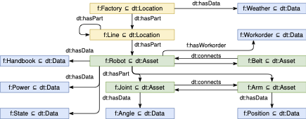

# DTBM - Digital Twin Benchmark Model
The Digital Twin Benchmark Model is an RDF benchmark model that creates a semantic knowledge graph model representing the Digital Twin of a factory line. It represents some unique challenges and requirements in scaling Digital Twins as explained in the ISWC 2022 paper [[1]](#1).

The DTBM has some uniqe characteristics that render it harder to scale that for example established benchmark models like BSBM [[2]](#2) and LUBM [[3]](#3). We provide scripts to compare against these benchmark models.

The provided scripts allow the user to run the tests using docker on various backend systems and various knowledge graphs. The code currently supports Blazegraph, GraphDB, and Virtuoso all of which are triple stores that expose SPARQL endpoints. The fourth system is Neo4j as most common property graph. The last one is KITT which is IBM's semantic property graph for Digital Twins.

We open source the code for running the benchmarks as we want to encourage people to run their own benchmarks for this use case and because we found it hard to setup a consistent benchmark environment.

The repository here only provides the scripts. Details and results for the DTBM are provided in the ISWC paper [[1]](#1).

# Model Details

The Digital Twin Benchmark Model creates Knowledge Graph of a Industry 4.0 scenario that is representing the Digital Twin of a production line. The figure below shows the main elements of the model structure.



The RDF model is split in a core model (`dt:*`) and a domain taxonomy (`f:*`) according to requirement. The core model defines the trinity of `Locations`, `Asset`, and `Data` that is common with other IoT ontologies like BRICK \cite{balaji2018brick}. To keep the benchmark self-contained we refrained from using any upper ontologies. The domain model represents of a location hierarchy in a `Factory` $ \sqsubseteq$ `Location` with multiple production lines. The production `Lines` $ \sqsubseteq$ `Location` may have a random depth of 1 to 3 levels to represent flexible hierarchies.

Each production line has multiple `Robot`s $\sqsubseteq$ `Asset` of different types as example for different machine types and subsumption. Each robot is composed off two to four `Joint` $\sqsubseteq$ `Asset` and `Arm` $\sqsubseteq$ `Asset` segments determining the degree of freedom to demonstrate composability.

The robots are connected by `Belt`s $\sqsubseteq$ `Asset` as example for a logistic transport system. It is to note, that the logistic system is introducing a horizontal element cutting across the hierarchical factory structure. These horizontal structures are very common and allow different views on the represented data.

For simplicity we stick to robots and belts in this example, but, they may be any machine and logistic element. This is a typical production process where a product passes trough a sequence of production steps.

Each robot has different data types attached: a handbook (`Data_File` $\sqsubseteq$ `Data`), workorder data (`Json` $\sqsubseteq$ `Data`), a power meter (`Data_Series_Numeric` $\sqsubseteq$ `Data_Series` $\sqsubseteq$ `Data`), and on/off state (`Data_Series_Categoric` $\sqsubseteq$ `Data_`-`Series` $\sqsubseteq$ `Data`) coming from different datastorage systems. Each robot joint has angle measurements and each robot arm has a position measurement to illustrate heterogenity. The belt has power meter and state as well to illustrate that data type may repeat across assets. The factory has weather data as example for a dataset at root level. All elements contain additional data properties to store meta-data such as asset ids or data keys linking to the data in the various backend systems.

The benchmark contains 12 queries. They resemble common type of queries that we see in applications run on the knowledge graph from querying information on specific assets to drive user interfaces and automatically configure and execute ML tasks on the data. The queries are heavily relying on subsumption and are using primarily generic concepts (`Locations`, `Asset`, `Data`). The queries also use transitive relationships like the `hasPart` relationship that is used to link the factory to lines, down to the robot, and its joints.

```sparql
INSERT {
  ?newfunc rdf:type dt:Function .
  ?newfunc dt:hasInputData ?weather .
  ?newfunc dt:hasInputData ?input .
  ?newfunc dt:hasOutputData ?newout .
  ?newout rdf:type f:Data_Power_Pred .
  ?newout dt:hasDataKeySeries "UNDEFINED" .
} WHERE {
  ?loc rdf:type dt:Location .
  ?loc dt:hasSeries ?weather .
  ?weather rdf:type f:Data_Weather .
  ?loc dt:hasPart+ ?asset .
  ?asset rdf:type f:Asset .
  ?asset dt:hasSeries ?input .
  ?input rdf:type f:Data_Power .
  BIND(IRI(CONCAT(STR(?asset),"_Pred")) AS ?newout).
  BIND(IRI(CONCAT(STR(?asset),"_Func")) AS ?newfunc).
}
```

For example, Query 10 above uses SPARQL update to configures a new analytic AI function for each asset (Robot or Belt) that has an associated power timeseries. It uses this power data as input for the analytic function and also adds the weather data as additional input feature from the closes parent owning one (factory). It then assigns an `UNDEFINED` data key to the also newly created output timeseries that later will be replaced with a pointer to the newly computed data. The benchmark contains also other examples for configuring AI functions like: Q9 - to aggregate across a location hierarchy or Q11 - to aggregate all instances by asset type. All queries follow the same template of utilizing a graph pattern (`WHERE`) to identify deployment locations for the AI functions with relevant inputs and a creation (`INSERT`) part to materialize the respective AI function. Their configurations could be added to the (`INSERT`) section or are in our case inherited from their type.

```sparql
CONSTRUCT {
  ?func rdf:type ?functype .
  ?func dt:hasInputData ?input .
  ?input dt:hasDataKey ?input_key .
  ?func dt:hasOutputData ?output .
  ?output dt:hasDataKey ?output_key .
} WHERE {
  BIND (f:factory1_line_1_robot_1_Func AS ?func) .
  ?func rdf:type dt:Function .
  ?func rdf:type ?functype .
  ?func dt:hasInputData ?input .
  ?input dt:hasDataKey ?input_key .
  ?func dt:hasOutputData ?output .
  ?output dt:hasDataKey ?output_key .
}
```

Query 12 retrieves the sub-graph for one of these created configurations that contains the inputs and outputs for computing the prediction in an ML job including the data keys. In the given example, this would be a new AI function to compute the prediction of the power meter at robot 1 on line 1 that uses as input the power meter history and the weather data and the newly created output.


# Executing the benchmark

For each backend (blazegraph, graphdb, kitt, neo4j, virtuoso) we provide bash scripts for executing the benchmarks like `graphdb/factory_graphdb.sh`. Each benchmark will execute multiple tests with different graph sizes and in each run spin up and configure the required backend containers using docker compose. Please ensure that you have docker and docker compose configured and running on your environment.

To execute the benchmark for LUBM and BSBM it is necessary to install the generator and evaluation packages. Please download the respective code for [BSBM](http://wbsg.informatik.uni-mannheim.de/bizer/berlinsparqlbenchmark/) and [LUBM](http://swat.cse.lehigh.edu/projects/lubm/) and unzip them in this repository such that a respective `bsbm-tools` and `lubm-tools` folder exist. Each backend folder will have a script (e.g. `blazegraph/bsbm_blazegraph.sh`) to run the benchmark. In case of errors, please verify that the paths are correct.

The required dockers for KITT are not publicly available. We included the test results for reference.

# Code structure

The code is very repetitative. We provide scripts to create the Digital Twin benchmark model 

* `dt_model_generator.py` - a python script to generate the digital twin benchmark model used in `*/factory_*.sh`
* `LUBM_Benchmark.py` - a python script test LUBM benchmark used in `*/lubm_*.sh`
* `fix_lubm.py` - a python script to remove imports from the generated LUBM model used in `*/lubm_*.sh`
* `evaluate All.ipynb` - A jupyter notebook to evaluate the created results
* `{backend}/factory_{backend}.sh` - a script to execute the DTBM benchmark with different backends
* `{backend}/bsbm_{backend}.sh` - a script to execute the BSBM benchmark with different backends
* `{backend}/lubm_{backend}.sh` - a script to execute the LUBM benchmark with different backends

The shell scripts will generate different result `*.xml` and `*.json` files in the respective subfolders. For comparison reasons, we included the one from our run.

# Citing DTBM

Please use for citing the benchmark model:

```bibtex
@inproceedings{DTBM22,
  Author = {Joern Ploennigs and Konstantinos Semertzidis and Fabio Lorenzi and Nandana Mihindukulasooriya},
  Title = {Scaling Knowledge Graphs for Automating AI of Digital Twins},
  Booktitle  = {International Semantic Web Conference (ISWC)},
  Year = {2022}
}
```

# References
<a id="1">[1]</a> Ploennigs, J.; Semertzidis, K.; Lorenzi, F.; and Mihindukulasooriya, N.: Scaling Knowledge Graphs for Automating AI of Digital Twins, *Int. Semantic Web Conference (ISWC)* (2022).

<a id="2">[2]</a> Bizer, C., Schultz, A.: The Berlin SPARQL benchmark. Int. *J. on Semantic Weband Information Systems (IJSWIS) 5 (2)*, pp. 1–24 (2009)

<a id="3">[3]</a> Guo, Y., Pan, Z., Heflin, J.: LUBM: A benchmark for OWL knowledge base systems. *J. of Web Semantics 3 (2-3)*, pp. 158–182 (2005)
